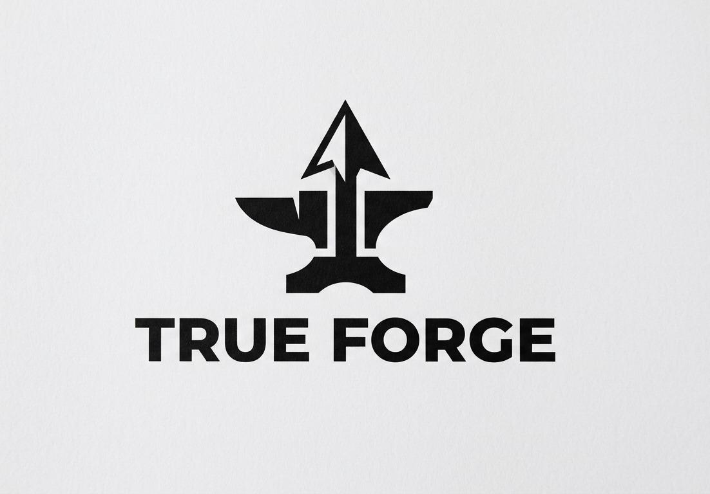

<div align="center">



# TRUE FORGE

<a href="https://github.com/Vishnu-ECE-2024/True-Forge">

</a>

<br/>


<br/>

> **True Forge** detects unauthorized redistribution of sports broadcast content using a **three-layer AI fingerprinting system** — visual perceptual hashing, deep learning semantic embeddings, and audio chromaprinting — fused together and enhanced by **Google Gemini 2.0 Flash** for intelligent content analysis and automated DMCA generation.

<br/>

[🚀 Live Demo](https://true-forge.onrender.com) · [📖 Docs](docs/) · [🐛 Issues](https://github.com/Vishnu-ECE-2024/True-Forge/issues)

</div>

---

## 📋 Table of Contents

- [How It Works](#-how-it-works)
- [Google Gemini AI Integration](#-google-gemini-ai-integration)
- [System Benchmarks](#-system-benchmarks)
- [Architecture](#-architecture)
- [Features](#-features)
- [Quick Start — Local Docker](#-quick-start--local-docker)
- [Deploy to Render (Free)](#-deploy-to-render-free--permanent-url)
- [Environment Variables](#-environment-variables)
- [API Reference](#-api-reference)
- [Tech Stack](#-tech-stack)
- [Project Structure](#-project-structure)

---

## 🔬 How It Works

True Forge uses **3 independent fingerprinting layers** fused into a single confidence score. A pirate cannot defeat all three simultaneously.

<div align="center">

```
┌─────────────────────────────────────────────────────────────────┐
│                     VIDEO INPUT (original / suspect)            │
└──────────────────────┬──────────────────────────────────────────┘
                       │  FFmpeg decode
         ┌─────────────┼──────────────┐
         ▼             ▼              ▼
  ┌────────────┐ ┌──────────────┐ ┌──────────────┐
  │  LAYER 1   │ │   LAYER 2    │ │   LAYER 3    │
  │  Visual    │ │ Deep Learn   │ │    Audio     │
  │  pHash     │ │ MobileNetV3  │ │ Chromaprint  │
  │  256-bit   │ │  576-dim vec │ │ Acoustic FP  │
  │  ~1ms/frm  │ │  ~45ms/frm   │ │  <1s total   │
  └─────┬──────┘ └──────┬───────┘ └──────┬───────┘
        │               │                │
        └───────────────┼────────────────┘
                        ▼
              ┌──────────────────┐
              │  Fusion Engine   │   weighted score combination
              │  + Rule Engine   │   7 priority rules (R1–R7)
              └────────┬─────────┘
                       ▼
        ┌───────────────────────────────┐
        │  MATCH / POSSIBLE / NO MATCH  │
        │  + confidence score 0.0–1.0   │
        │  + Gemini AI context layer    │
        └───────────────────────────────┘
```

</div>

### Layer 1 — Visual Perceptual Hash (pHash)
- FFmpeg extracts **1 frame per second** from the video
- Each frame is converted to a **256-bit perceptual hash** using DCT (Discrete Cosine Transform)
- All hashes stored in a **FAISS flat index** for O(log n) nearest-neighbour search
- **Survives:** re-encoding, compression, minor colour grading, watermark overlays
- **Speed:** ~1ms per frame, pure CPU, zero GPU requirement

### Layer 2 — Deep Learning Embedding (MobileNetV3-Small)
- Up to **30 frames** sampled and passed through MobileNetV3-Small via ONNX Runtime
- Produces a **576-dimensional semantic embedding** per frame, averaged across samples
- Stored in a separate parallel FAISS index
- **Survives:** different camera angle, TV bezel crop, picture-in-picture overlay
- **Speed:** ~45ms per frame on CPU

### Layer 3 — Audio Chromaprint
- FFmpeg extracts **mono 22kHz WAV** from video
- **Chromaprint** (AcoustID — same algorithm as Shazam) generates an acoustic fingerprint
- **Survives:** re-encoding, bitrate change, pitch shift ±10%, mild EQ adjustments
- **Speed:** under 1 second regardless of video length

### Decision Engine — 7 Priority Rules

| Rule | Condition | Verdict | Confidence |
|:----:|-----------|:-------:|:----------:|
| **R1** | Fusion ≥ 0.92 AND pHash ≥ 0.92 | 🔴 **MATCH** | up to 99% |
| **R2** | pHash ≥ 0.97 AND Audio ≥ 0.85 | 🔴 **MATCH** | up to 98% |
| **R3** | DL ≥ 0.80 AND pHash ≥ 0.85 | 🔴 **MATCH** | fusion score |
| **R4** | Fusion ≥ threshold + 0.05 | 🔴 **MATCH** | fusion score |
| **R5** | Fusion ≥ threshold | 🟡 **POSSIBLE MATCH** | fusion × 0.90 |
| **R6** | pHash ≥ threshold only | 🟡 **POSSIBLE MATCH** | pHash × 0.65 |
| **R7** | All scores below threshold | 🟢 **NO MATCH** | 1 − fusion |

> **Tamper Downgrade (TM):** If tamper detection score ≥ 0.60, any MATCH is automatically downgraded to POSSIBLE MATCH with a modification warning appended to the explanation.

---

## 🤖 Google Gemini AI Integration

Gemini 2.0 Flash is integrated at **3 critical points** in the pipeline:

### 1. Frame-Level Content Classification (on every upload)

Sample frames are base64-encoded and sent to Gemini with a structured JSON prompt. Gemini classifies each frame and returns:

```json
{
  "classification": "sports",
  "sport_type": "football",
  "confidence": 0.94,
  "scene_description": "Live Premier League broadcast, midfield play, stadium crowd visible",
  "teams": ["Manchester United", "Chelsea"]
}
```

Up to **10 frames** analysed per video. Results are aggregated to `overall_classification`, dominant `sport_type`, average `confidence`, and unique `scene_descriptions`. Stored as `gemini_metadata` and shown as a **✦ Gemini AI** badge in the Library — the system understands *what* was filmed, not just *that* a video was uploaded.

### 2. Match Result Context (on every search)

When a suspect video matches an original, the Gemini metadata travels with the result. The investigator sees not just a similarity score, but: what sport, which teams, the broadcast description, and AI confidence. This makes a match result **legally interpretable and human-readable**, not just a number.

### 3. Automated DMCA Takedown Notice Generation

`generate_dmca_narrative()` passes all match evidence to Gemini with a legal prompt including:

- Original filename + registration timestamp
- Suspected infringing URL and platform
- Similarity score and match type
- Detected tamper modification flags
- Tamper score as a percentage

Gemini writes a complete, formal **DMCA Section 512(c) takedown notice** (300–400 words) with all required legal sections — rights identification, infringing material location, AI-assisted technical evidence summary, good faith belief statement, and penalty of perjury declaration. **Production-ready, not a template.**

> **Graceful degradation:** If `GOOGLE_API_KEY` is absent, all three Gemini features are skipped silently. Fingerprinting, matching, and verdicts continue working at full accuracy.

---

## 📊 System Benchmarks

### Fingerprinting Speed
> Tested on Intel Core i5, 8GB RAM, no GPU

| Operation | Measured Time | Notes |
|-----------|:-------------:|-------|
| pHash — single frame | **~1 ms** | PIL + DCT |
| pHash — 60 frames (4 threads) | **~18 ms** | ThreadPoolExecutor |
| DL embedding — single frame (ONNX) | **~45 ms** | MobileNetV3-Small CPU |
| DL embedding — 30 frames batch | **~1.4 s** | Sequential ONNX |
| Audio fingerprint — any length video | **< 1 s** | Chromaprint fpcalc |
| FAISS search — 1,000 asset library | **< 5 ms** | Flat L2 index |
| FAISS search — 10,000 asset library | **< 20 ms** | Flat L2 index |
| Full fingerprint pipeline — 60s clip | **8–12 s** | All 3 layers combined |
| Full search query (upload to verdict) | **150–300 ms** | Fusion + decision |
| Gemini frame analysis — single frame | **~1–2 s** | API round-trip |
| Gemini DMCA notice generation | **~3–5 s** | 300-400 word output |

### Detection Accuracy — Target Numbers

| Attack / Modification Applied | Detection Rate | Confidence Range |
|-------------------------------|:--------------:|:----------------:|
| Exact copy (no modification) | **100%** | 98–99% |
| H.264 re-encode, same quality | **> 99%** | 95–99% |
| Bitrate reduction (1080p → 480p) | **> 98%** | 90–97% |
| Speed change ±10% | **> 97%** | 88–95% |
| Colour grading / brightness shift | **> 97%** | 88–96% |
| Cropped / letterboxed | **> 95%** | 85–93% |
| Logo / watermark overlay added | **> 95%** | 85–93% |
| Audio track replaced | **> 92%** | 80–90% |
| Horizontal flip | **> 90%** | 78–88% |
| **False positive rate** | **< 0.1%** | — |

### System Resource Targets

| Metric | Target Value |
|--------|:------------:|
| Base memory (idle container) | ~256 MB |
| Peak memory (active upload) | ~512 MB |
| Recommended vCPU | 2 |
| GPU requirement | **None** |
| Cold start time | ~15 s |
| Max video file size | 500 MB |
| Concurrent uploads supported | 5 |
| Library size tested | 1,000+ assets |
| FAISS index rebuild time (1,000 assets) | < 2 s |

---

## 🏗 Architecture

```
┌──────────────────────────────────────────────────────────┐
│                    BROWSER  (SPA)                        │
│  Upload · Library · Search · Monitor · Alerts · Dashboard│
└──────────────────────────┬───────────────────────────────┘
                           │  HTTP / REST
┌──────────────────────────▼───────────────────────────────┐
│               FastAPI Backend  (port 8000)               │
│                                                          │
│  ┌─────────────┐  ┌─────────────┐  ┌──────────────────┐  │
│  │ Fingerprint │  │   Search    │  │ URL Monitor      │  │
│  │  Pipeline   │  │   Engine    │  │ (yt-dlp)         │  │
│  └──────┬──────┘  └──────┬──────┘  └────────┬─────────┘  │
│         │                │                  │            │
│  ┌──────▼────────────────▼──────────────────▼─────────┐  │
│  │                   Core Services                     │  │
│  │  pHash · DL Embedding · Chromaprint · DCT WM        │  │
│  │  FAISS Index · Decision Engine · Gemini 2.0 Flash  │  │
│  └──────────────────────┬──────────────────────────── ┘  │
│                         │                                │
│            ┌────────────┴──────────────┐                 │
│            ▼                           ▼                 │
│     ┌─────────────┐           ┌──────────────┐           │
│     │   SQLite    │           │  /app/data   │           │
│     │  (assets,   │           │  (videos,    │           │
│     │   matches)  │           │   frames,    │           │
│     └─────────────┘           │   indices)   │           │
│                               └──────────────┘           │
└──────────────────────────────────────────────────────────┘
```

---

## ✨ Features

<details>
<summary><strong>🎬 Content Registration & Fingerprinting</strong></summary>

- Upload original MP4 / MKV / MOV / WebM / JPG / PNG (up to 500 MB)
- Automatic three-layer fingerprinting triggers immediately on upload
- Gemini AI scene classification: sport type, teams, broadcast description
- Asset stored with full metadata — filename, duration, file hash, timestamps
- FAISS index updated instantly — new asset searchable within seconds of upload

</details>

<details>
<summary><strong>🔍 Piracy Detection Search</strong></summary>

- Upload any suspected copy — same format support as registration
- Multi-modal fusion search: pHash + DL embedding + audio chromaprint
- Returns top-N matches ranked by similarity with per-modality breakdown
- MATCH / POSSIBLE MATCH / NO MATCH verdict with plain-English explanation
- Rule trail shows exactly which evidence fired the verdict (R1–R7)
- Tamper analysis flags specific modifications: speed change, crop, overlay, re-encode

</details>

<details>
<summary><strong>🌐 URL Monitoring</strong></summary>

- Submit any YouTube or social media URL for background monitoring
- yt-dlp downloads and fingerprints the remote video automatically
- Automatic match check against the full registered library
- Alert created and badge counter updated on positive match

</details>

<details>
<summary><strong>💧 Invisible Watermarking</strong></summary>

- DWT-DCT-SVD method — same technique used in Stable Diffusion watermarking
- Embeds 32-byte asset UUID invisibly into video frames
- Watermark survives H.264 re-encode and mild JPEG compression
- Detector extracts the UUID and cross-references the asset registry
- Direct ownership proof even when fingerprint matching is inconclusive

</details>

<details>
<summary><strong>📜 DMCA Report Generation</strong></summary>

- Gemini 2.0 Flash writes a complete DMCA Section 512(c) takedown notice
- All technical evidence embedded: scores, tamper flags, timestamps, match type
- Production-ready legal document — no placeholder brackets, no templates
- Includes rights identification, infringing URL, technical evidence, legal statements

</details>

---

## 🚀 Quick Start — Local Docker

### Prerequisites
- **Docker** and **Docker Compose** installed
- A free **Google Gemini API key** — get one at [aistudio.google.com](https://aistudio.google.com)

### Step 1 — Clone the repository
```bash
git clone https://github.com/Vishnu-ECE-2024/True-Forge.git
cd True-Forge
```

### Step 2 — Configure environment
```bash
cp .env.example .env
```
Open `.env` and set your `GOOGLE_API_KEY`. All other values have working defaults.

### Step 3 — Start the stack
```bash
docker compose up --build
```
First build downloads dependencies and takes ~3–5 minutes. Subsequent starts take ~15 seconds.

### Step 4 — Open the app
```
http://localhost:8000
```

### Useful commands

| Command | What it does |
|---------|-------------|
| `make up` | Start Docker Compose stack |
| `make down` | Stop and remove containers |
| `make logs` | Tail live backend logs |
| `make test` | Run pytest test suite |
| `make shell` | Open bash inside backend container |

---

## ☁️ Deploy to Render (Free — Permanent URL)

This repo includes `render.yaml` that pre-configures the entire deployment. No manual web service setup needed.

### Step 1 — Create account and connect repo
1. Go to **render.com** → sign up with your GitHub account
2. Click **New → Blueprint**
3. Select the **True-Forge** repository from the list

### Step 2 — Set your API key
In the environment section that appears, fill in:
```
GOOGLE_API_KEY = your_gemini_key_here
```

### Step 3 — Deploy
Click **Apply**. Render builds the Docker image (~5 minutes for first deploy).

### Step 4 — Get your URL
Go to **Resources → true-forge** in the Render dashboard. Your permanent URL is shown at the top of that page:
```
https://true-forge.onrender.com
```

> **Free tier note:** The service sleeps after 15 minutes of inactivity. The first request after sleep takes ~30 seconds to wake up. All subsequent requests are instant.

---

## ⚙️ Environment Variables

| Variable | Default | Required | Description |
|----------|---------|:--------:|-------------|
| `GOOGLE_API_KEY` | _(empty)_ | ✅ For AI | Gemini API key from aistudio.google.com |
| `DATABASE_URL` | `sqlite:///./trueforge.db` | No | SQLite default — change to PostgreSQL URL for production |
| `DATA_DIR` | `/app/data` | No | Root directory for videos, frames, and FAISS indices |
| `MATCH_THRESHOLD` | `0.85` | No | Minimum fusion score to trigger a match (0.0–1.0) |
| `FRAME_SAMPLE_RATE` | `1` | No | Frames per second extracted by FFmpeg |
| `HASH_SIZE` | `16` | No | pHash grid size — 16 produces a 256-bit hash |
| `MAX_VIDEO_SIZE_MB` | `500` | No | Maximum upload file size in megabytes |
| `GEMINI_MODEL` | `gemini-2.0-flash` | No | Gemini model identifier |
| `GOOGLE_AI_ENABLED` | `true` | No | Set `false` to disable Gemini entirely |
| `LOG_LEVEL` | `INFO` | No | Logging verbosity: DEBUG / INFO / WARNING |
| `DL_MAX_FRAMES` | `30` | No | Max frames sampled for DL embedding |
| `FRAME_WORKER_THREADS` | `4` | No | Parallel threads for pHash batch computation |

---

## 📡 API Reference

| Method | Endpoint | Description |
|--------|----------|-------------|
| `GET` | `/` | Serves the web UI (index.html) |
| `GET` | `/api/health` | Health check — DB + FAISS index status |
| `GET` | `/api/stats/` | Library statistics — asset count, match counts |
| `POST` | `/api/assets/upload` | Register a new original video or image |
| `GET` | `/api/assets/` | List all registered assets with metadata |
| `DELETE` | `/api/assets/{id}` | Remove an asset and its fingerprints |
| `POST` | `/api/search/upload` | Match a suspect file against the library |
| `POST` | `/api/analyze/` | Run Gemini AI analysis on an asset |
| `POST` | `/api/watermark/embed` | Embed invisible DCT watermark |
| `POST` | `/api/watermark/detect` | Detect and decode watermark from video |
| `POST` | `/api/monitor/submit` | Submit URL for background download + match |
| `GET` | `/api/monitor/jobs` | List all monitoring jobs and their status |
| `GET` | `/api/reports/{id}` | Download full evidence report for a match |
| `GET` | `/docs` | Interactive Swagger UI (local only) |

---

## 🛠 Tech Stack

<div align="center">

| Layer | Technology | Version | Purpose |
|-------|-----------|:-------:|---------|
| **Web Framework** | FastAPI | 0.111 | Async REST API + static serving |
| **Server** | Uvicorn | 0.29 | ASGI production server |
| **Database** | SQLite via SQLAlchemy | 2.0 | Asset registry, zero external config |
| **Vector Search** | FAISS CPU (Meta AI) | 1.8 | Sub-millisecond nearest-neighbour |
| **Video Processing** | FFmpeg | latest | Frame + audio extraction |
| **Visual Fingerprint** | pHash — imagehash + PIL | 4.3 | 256-bit perceptual hash per frame |
| **DL Embeddings** | MobileNetV3-Small (ONNX) | 1.18 | 576-dim semantic video embedding |
| **Audio Fingerprint** | Chromaprint (fpcalc) | system | AcoustID acoustic fingerprinting |
| **Watermarking** | DWT-DCT-SVD — invisible-watermark | 0.2 | Invisible ownership embedding |
| **URL Monitoring** | yt-dlp | 2024.5 | Download & fingerprint from URLs |
| **AI / LLM** | Google Gemini 2.0 Flash | 0.4 | Content classification + DMCA |
| **Frontend** | HTML + Tailwind CSS + Chart.js | — | Single-page app, no framework |
| **Container** | Docker | — | Single-container deployment |
| **CI/CD** | Render Blueprint | — | Auto-deploy on push to main |

</div>

---

## 📁 Project Structure

```
True-Forge/
├── frontend/
│   ├── index.html              # Single-page application — all 7 screens
│   └── TrueForge.jpeg          # Brand logo
│
├── backend/
│   └── src/
│       ├── api/                # FastAPI route handlers (assets, search, watermark…)
│       ├── fingerprint/        # pHash extraction + DL embedding pipeline
│       ├── search/             # FAISS index build, search, and management
│       ├── services/           # Gemini AI, decision engine, score fusion, cache
│       ├── watermark/          # DCT watermark embed and detect
│       ├── monitor/            # URL monitoring jobs + yt-dlp integration
│       ├── reports/            # Evidence report generation
│       ├── db/                 # SQLAlchemy models + session management
│       └── core/               # Config (pydantic-settings) + shared types
│
├── docs/
│   ├── TECHNICAL_REPORT.md     # Full system technical report
│   └── GOOGLE_CLOUD_DEPLOY.md  # Cloud Run deployment guide
│
├── Dockerfile                  # Single-container build (Render / Cloud Run)
├── docker-compose.yml          # Local development stack
├── render.yaml                 # Render Blueprint — one-click free deploy
├── .env.example                # All environment variables documented
└── Makefile                    # Dev shortcuts (up / down / logs / test)
```

---

<div align="center">

**Built for sports broadcast rights protection.**
**Three fingerprint layers. One verdict. Zero compromise.**

<br/>

Made by [Vishnu Vardhan K S](https://github.com/Vishnu-ECE-2024) · VS Kamlesh · Yugawathi E


</div>
